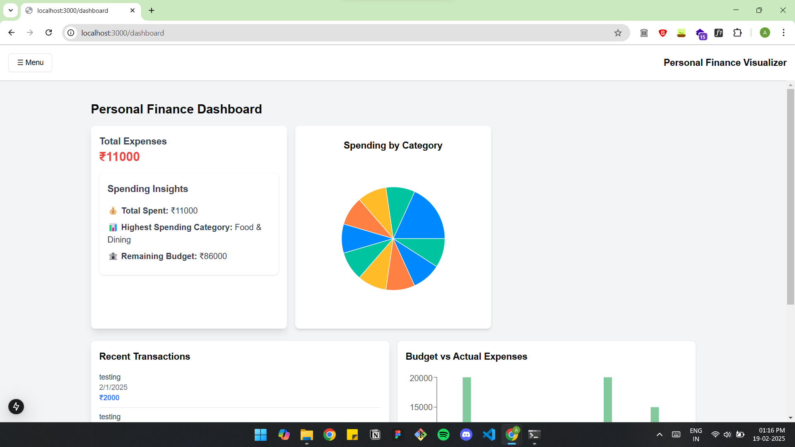
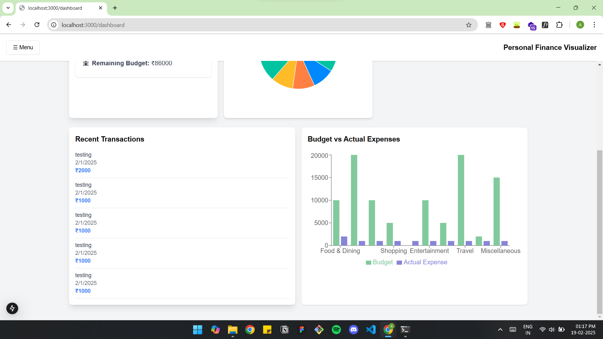
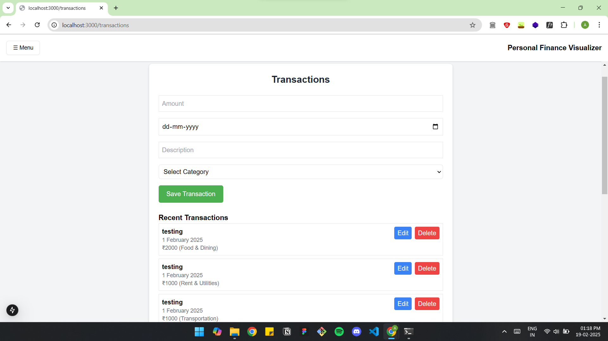
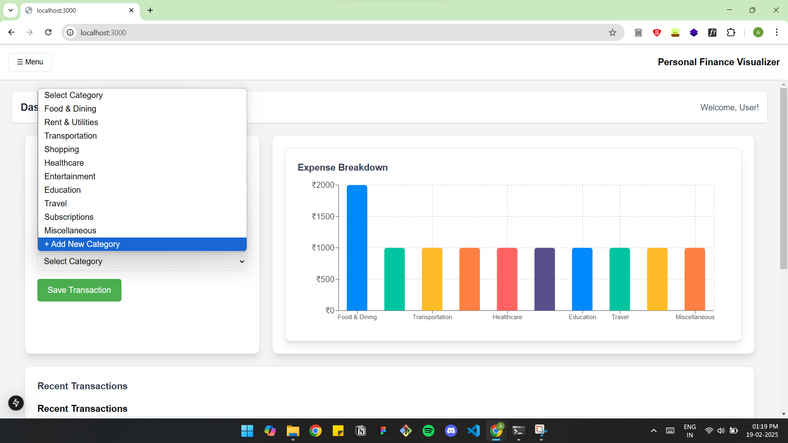
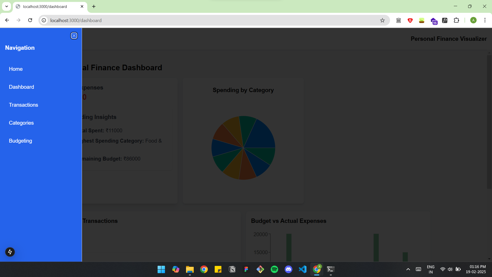

# Personal Finance Visualizer

## Overview
Personal Finance Visualizer is a web application that helps users track expenses, analyze spending habits, and manage their budgets effectively. It provides interactive charts, transaction management, and insightful reports.

## Features
- **Dashboard**: Overview of recent transactions and spending insights.
- **Expense Tracking**: Add, edit, and delete transactions.
- **Budgeting**: Manage budgets for different spending categories.
- **Visual Analytics**: Pie charts and breakdowns for better financial insights.
- **Responsive Design**: Works across all devices.

## Tech Stack
- **Frontend**: Next.js, React, shadcn/ui, Tailwind CSS, Recharts
- **Backend**: Next.js API Routes (Node.js, Express-like routing)
- **Database**: MongoDB (via Mongoose)
- **State Management**: React Hooks, Context API

## Installation
1. Clone the repository:
   ```sh
   git clone https://github.com/ankit-o07/Personal-Finance-Visualizer.git
   cd personal-finance-visualizer
   ```
2. Install dependencies:
   ```sh
   npm install
   ```
3. Run the development server:
   ```sh
   npm run dev
   ```
4. Open [http://localhost:3000](http://localhost:3000) in your browser.

## API Endpoints
- `GET /api/transactions` - Fetch all transactions.
- `POST /api/transactions` - Add a new transaction.
- `PATCH /api/transactions/:id` - Update a transaction.
- `DELETE /api/transactions/:id` - Delete a transaction.
- `GET /api/categories` - Fetch all categories.

## Project Structure
```
public/
src/
  ├── app/
  ├── components/
  ├── lib/
  ├── models/
  ├── config/
```

## Screenshots
### Dashboard




### category


### Home Page



### Transactions List


## Contribution
Feel free to open issues or contribute by submitting a pull request.

## Contribution
Feel free to open issues or contribute by submitting a pull request.


